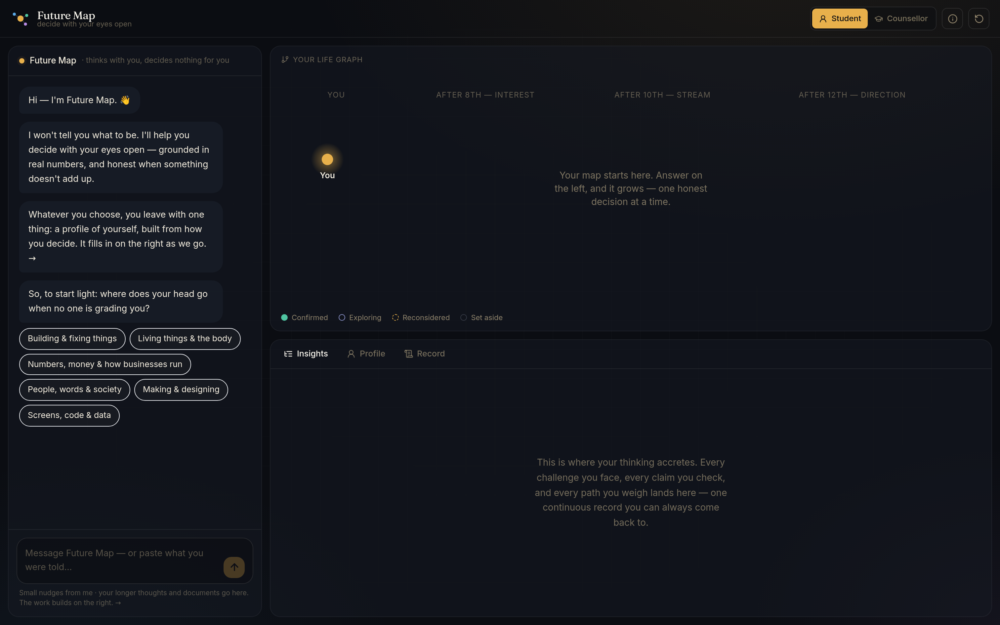
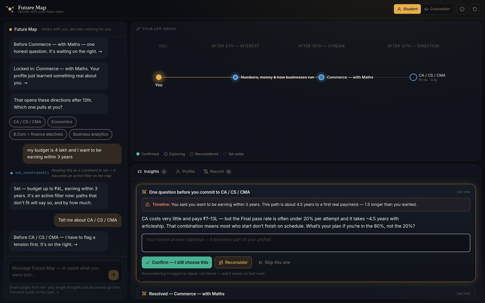
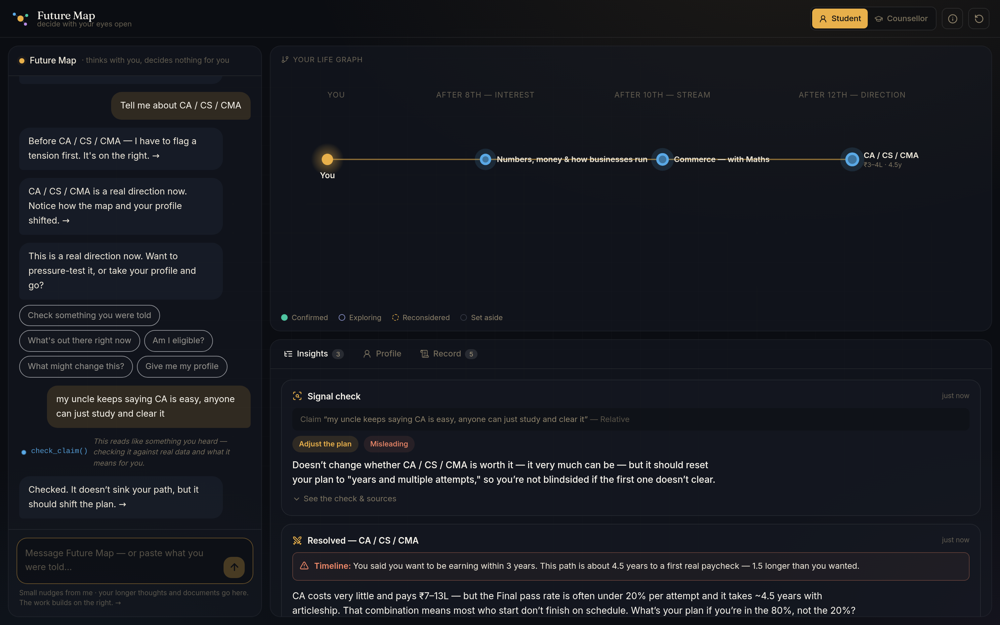
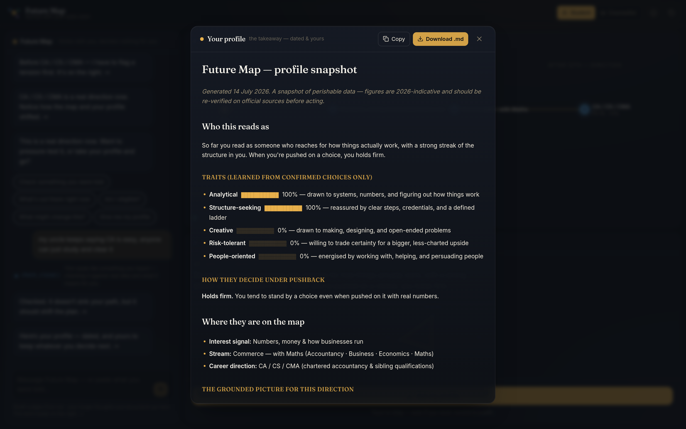

# Future Map

**Decide with your eyes open.**

A grounded, challenge-driven companion for choosing a stream and a career — built for
students in grades 8–12, and usable by a counsellor on a student's behalf. The chat
stays deliberately small; the **life graph**, the **insights**, and the **profile it
learns about you** are the point.

> It never tells you what to be. It informs, it pushes back on your reasoning with real
> numbers, and — whatever you decide — it hands you a profile of yourself as the takeaway.



---

## The idea

Most career advice fails in one of two ways: it's a wall of information that overwhelms,
or it's a rubber stamp that flatters. Future Map is neither.

- **The chat is small.** The system sends short, single-idea nudges. You reply with a tap
  or a longer thought. Nothing lectures you.
- **The artefact is the hero.** Beside the chat, a life graph grows as you decide — an
  interest → a stream → a career direction. Every check you run and every claim you test
  accretes into one continuous record. A five-trait profile fills in from *how you decide*,
  not from a quiz.
- **It learns you from the interaction itself.** No personality test. Your traits and your
  conviction under pressure are inferred purely from the choices you put through a
  challenge and confirm.
- **The profile is guaranteed.** Even if you never commit to a path, you leave with a
  dated, plain-language snapshot of who you are and what you examined — copyable and
  downloadable.

### Five commitments (they resolve every ambiguity)

1. **Grounded, never guessed** — every cost, cutoff, and pay figure is real, sourced, and
   dated. Never recited from memory.
2. **Never a rubber stamp** — every commitment is challenged with a real number before it's
   yours. Directness over comfort.
3. **Reconsidering is signal** — backing out is logged and read as seriously as confirming,
   never as a wrong answer.
4. **It never decides** — it researches, checks, compares, and recommends. The deliberate
   commit stays a human click, always.
5. **One continuous record** — every choice, check, and reconsideration lives in one place
   you can always return to.

---

## What's built

| Area | Feature |
|---|---|
| **The map** | Three tiers (interest → stream → career), 6 interests · 5 streams · 19 researched career clusters, plus live path research that extends the map to real off-map options ("what about data science?"). |
| **Grounding** | Every stage-3 node carries real 2026-indicative cost range, years-to-first-paycheck, and starting pay, with an "as of" freshness date and a link to the **primary** source (JEE/NEET/ICAI/UPSC/CLAT/CUET official portals). |
| **The challenge** | Confirming a stream or career is gated by a pushback question grounded in a real number. Budget, timeline, eligibility, and profile *mismatches* are named explicitly **before** the question. Confirm / Reconsider / Skip — each with a judgment-free exit. |
| **Profile** | Five traits (analytical · creative · risk · people · structure) + a conviction signal (how you hold a position under pushback), accumulated from confirmed choices only, shown as a live radar and read back in plain language. |
| **Signal check** | Log a claim you heard and who said it. It's checked against real data **and** against *your* actual path — the decisive "does this change anything for you?" is the headline; truth-verdict and primary/secondary-weighted sources are the supporting detail. |
| **Constraints** | Set a budget and a max timeline in plain language ("my budget is 4 lakh"). They become active filters that flag paths and feed the challenge. |
| **Eligibility** | Enter a percentage (and, optionally and privately, a reservation category). Flags read "typically requires X, yours is Y, verify on the source" — never a closed door. Category-aware, and it degrades gracefully to clearly-caveated general framing when not provided. |
| **Agent tools** | A single natural-language entry point routes to `check_claim`, `set_constraint`, `research_path`, `check_freshness`, `check_eligibility`, `find_workaround`, `check_financial_aid`, `compare_paths`, `check_deadlines`. Every tool call is shown as it happens (show-your-work). **No tool can confirm a path for you.** |
| **Human escalation** | A values/wellbeing signal (family pressure, distress) is recognised, named plainly, and routed to a person + the Tele-MANAS helpline — never forced into a data-flavoured verdict. |
| **Continuity** | Everything persists locally across sessions. Checklist items can be ticked off over time. |
| **Export** | A dated, plain-language profile snapshot — the guaranteed takeaway — as copyable/downloadable Markdown. |
| **Modes** | Student and Counsellor framing, sharing the same underlying profile. |

### The challenge names the tension before it asks



### Signal check — is this true, and does it change anything *for you*?



### The profile you leave with



---

## Architecture

Framework-agnostic engine, thin UI over it.

```
src/
  engine/            # pure, framework-agnostic TypeScript — the product logic
    types.ts         #   DecisionNode, Vector5, ClaimVerdict, EligibilityCheck, records
    seed.ts          #   6 interests · 5 streams · 19 career clusters (2026 seed data)
    profile.ts       #   trait accumulation, conviction, normalisation, plain-language read
    challenge.ts     #   grounded pushback + budget/timeline/eligibility/profile mismatches
    eligibility.ts   #   probabilistic, category-aware, never a closed door
    signal.ts        #   claim → truth verdict + impact-on-your-path (+ distress detection)
    grounding.ts     #   the GroundingProvider seam + agent tool catalog
    agent.ts         #   natural-language intent routing (never confirms a path)
    export.ts        #   the dated profile snapshot
  store/             # zustand store — the conversation engine + single source of truth
  ui/                # React + Tailwind + framer-motion
    chat/            #   the small-message chat rail + composer
    graph/           #   the life graph (bespoke animated SVG) + node detail drawer
    insights/        #   the accreting insight cards (challenge, verdict, freshness, …)
    profile/         #   the live trait radar + conviction + portrait + export
    record/          #   the one unified chronological record
```

### The grounding seam (thesis #1)

The product's whole reason to exist is that figures are *real and current*, never recited.
Every data function goes through a `GroundingProvider` (`src/engine/grounding.ts`):

- **`SeedGroundingProvider`** (shipped) reasons over a curated, honestly-dated 2026 seed
  library — the same verdict shapes a live provider returns, so the entire experience runs
  offline. Where a claim is outside its scope, it says so plainly rather than fabricating
  confidence.
- **A `LiveGroundingProvider`** (the deployment target) implements the same interface,
  backed by a real search + primary-source-weighted read behind a small key-holding
  server. Swapping it in is a config change, not a rewrite.

Because a browser app can't safely hold API keys, this build ships the seed provider and
labels its data as such — with visible "as of" dates and "verify on the official source"
posture throughout, exactly as the spec requires.

---

## Run it

```bash
npm install
npm run dev        # http://localhost:5173
```

```bash
npm run build      # typecheck + production build to dist/
npm run preview    # serve the production build
```

Node 18+ recommended. State persists in `localStorage`; use the ↺ button (top right) to
start over.

---

## Deliberately deferred

Faithful to the spec's phased roadmap, these are architected-for but not built here:
transcript OCR import, background freshness monitoring, family collaboration / shared
views, learned trait embeddings, and the live grounding backend. Each has a clear seam in
the engine.

---

## A note on the data

Every figure here is 2026-indicative seed research, shown with a date and a primary source.
It is a *starting point for a conversation*, not a system of record. Cutoffs, costs, and
deadlines move — always verify on the official source before acting. Future Map is not a
replacement for a licensed counsellor; it's a grounded, honest place to begin.
